<p align="center">
  <a href="#situation-report">
    
  </a>
</p>

<p align="center">
  
  &nbsp;
  
  &nbsp;
  
</p>

---

**Your support team talks to customers all day. Your product team reads dashboards.** One group knows what's actually wrong. The other decides what to build. FeedForward is the wire between them.

It reads your Intercom conversations. Classifies them. Extracts the specific product theme — not "product issue" but `pinterest_pin_scheduling_failure`. Scores confidence. Runs PM-style review. Produces sprint-ready stories with evidence bundles.

**The support queue goes in. Sprint-ready stories come out.**

---

## INTERCEPT LOG

> _Fictional example — no real user data. Demonstrates pipeline output format._

| INCOMING SIGNAL                                                                                                                                                     | EXTRACTED INTELLIGENCE                                  |
| ------------------------------------------------------------------------------------------------------------------------------------------------------------------- | ------------------------------------------------------- |
| **Customer:** "Every time I try to schedule a pin for next week it just spins and then says 'something went wrong.' I've tried three browsers. My team is blocked." | **Classification:** `product_issue` (confidence: 0.94)  |
| **Agent:** "Thanks for reporting. I've escalated this to engineering — we're seeing this on accounts with 50+ scheduled pins."                                      | **Theme:** `pinterest_pin_scheduling_failure`           |
| **Customer:** "This has been happening since Tuesday. We had to manually post everything."                                                                          | **Confidence:** 0.87 (semantic + facet)                 |
|                                                                                                                                                                     | **Story:** _Pin scheduling fails above queue threshold_ |
|                                                                                                                                                                     | **Evidence:** 3 conversations, 2 affected accounts      |

One conversation becomes one data point. Twenty data points become one story. The story lands in your sprint with evidence attached.

---

## OPERATIONAL OVERVIEW

> _aka: What does the pipeline actually do?_

```
# illustrative — shows pipeline shape, not actual metrics

$ feedforward run --days 7

  INGEST    ▸ Pulling conversations from Intercom...
  CLASSIFY  ▸ Stage 1: Fast routing by type
              ├── product_issue
              ├── feature_request
              ├── how_to
              └── billing
  CLASSIFY  ▸ Stage 2: Deep analysis with full thread context
  EXTRACT   ▸ Theme identification from managed vocabulary
  DIGEST    ▸ Diagnostic summaries + verbatim key excerpts
  SCORE     ▸ Confidence assessment (semantic + facet similarity)
  REVIEW    ▸ PM review: keep / split / reject groupings
  CREATE    ▸ Story generation with evidence bundles

  ✓ Sprint-ready stories filed
  ✓ Orphan conversations queued for future graduation
  ✓ Board synced to Shortcut
```

> _Conceptual overview — simplified for readability. Omits error paths, orphan routing, and internal substages. See [Technical Specifications](#technical-specifications) for the full architecture._

```mermaid
graph LR
    A["🎧 Intercom"] --> B["Stage 1\nFast Classify"]
    B --> C["Stage 2\nDeep Classify"]
    C --> D["🔍 Extract\nThemes"]
    D --> E["📊 Score\nConfidence"]
    E --> F["🧑‍💼 PM\nReview"]
    F --> G["📋 Create\nStories"]
    G --> H["🚀 Sprint\nBoard"]

    style A fill:#1a1a2e,stroke:#00ff41,color:#00ff41
    style B fill:#16213e,stroke:#0f3460,color:#e0e0e0
    style C fill:#16213e,stroke:#0f3460,color:#e0e0e0
    style D fill:#1a1a2e,stroke:#00ff41,color:#00ff41
    style E fill:#16213e,stroke:#0f3460,color:#e0e0e0
    style F fill:#1a1a2e,stroke:#00ff41,color:#00ff41
    style G fill:#16213e,stroke:#0f3460,color:#e0e0e0
    style H fill:#1a1a2e,stroke:#00ff41,color:#00ff41
```



**Classification** routes conversations by type using a two-stage approach — Stage 1 classifies from the customer message alone for fast routing, Stage 2 re-analyzes with the full support thread for accuracy.

**Theme Extraction** identifies the _specific_ issue — not just "product issue" but `pinterest_pin_scheduling_failure`. Uses a managed vocabulary, URL-based product area hints, and generates diagnostic summaries with verbatim customer excerpts.

**Confidence Scoring** evaluates whether conversations sharing a theme actually belong together, using semantic similarity, intent homogeneity, symptom overlap, and product/component matching.

**PM Review** asks an LLM "would these all go in the same sprint ticket?" and can split mixed groups or reject incoherent ones entirely.

**Story Creation** applies quality gates (evidence validation, minimum group size of 3, 30-day recency), bundles evidence, and routes failures to orphan accumulation for future graduation.

---

## ██████ SIGNALS INTELLIGENCE ██████

> _AI-orchestrated 6-stage discovery pipeline — finds what customers haven't told you yet._

<details>
<summary><b>[ CLICK TO DECLASSIFY ]</b></summary>

<br />

The extraction pipeline processes what customers _tell_ you. The Discovery Engine finds what they _haven't told you yet_.

Beyond reactive theme extraction, FeedForward includes an AI-orchestrated system that proactively surfaces product opportunities humans might miss. It runs as a 6-stage pipeline:

| Stage | Codename                  | Mission                                                                                            |
| ----- | ------------------------- | -------------------------------------------------------------------------------------------------- |
| 0     | **Exploration**           | 4 domain explorers (Customer Voice, Codebase, Analytics, Research) independently scan data sources |
| 1     | **Opportunity Framing**   | PM agent synthesizes explorer findings into problem-focused briefs                                 |
| 2     | **Solution + Validation** | Iterative design loop — PM drafts, validation stress-tests, experience evaluates UX                |
| 3     | **Feasibility + Risk**    | Technical scoping with risk assessment                                                             |
| 4     | **Prioritization**        | TPM-style ranking across the full opportunity set                                                  |
| 5     | **Human Review**          | Final checkpoint before execution                                                                  |

Phase 1 infrastructure is complete with full orchestration accessible via `POST /api/discovery/runs`.

</details>

---

## FIELD ASSESSMENT

> _aka: The numbers_

<!-- verified 2026-02-09: pytest --co -q | tail -1 → "2492 tests collected" -->
<!-- verified 2026-02-09: grep -r "@router\." src/api/routers/ | wc -l → 63 -->
<!-- verified 2026-02-09: discovery explorers: analytics_explorer.py, codebase_explorer.py, customer_voice.py, research_explorer.py → 4 -->

| Metric              | Count                                        | As of      |
| ------------------- | -------------------------------------------- | ---------- |
| Test suite          | **2,400+** across fast / medium / slow tiers | 2026-02-09 |
| API endpoints       | **60+** REST routes                          | 2026-02-09 |
| Discovery explorers | **4** domain-specific agents                 | 2026-02-09 |
| Discovery stages    | **6** orchestrated pipeline stages           | 2026-02-09 |

---

## ASSET INVENTORY

> _aka: Tech stack_

- **Language** — Python 3.10+
- **API** — FastAPI
- **Frontend** — Next.js, React, TypeScript, Tailwind CSS
- **LLM** — OpenAI gpt-4o-mini
- **Database** — PostgreSQL + pgvector
- **Testing** — pytest with tiered markers (fast / medium / slow)
- **Issue Sync** — Shortcut API (bidirectional)
- **Data Sources** — Intercom API + Coda research docs

---

## DEPLOYMENT PROTOCOL

> _aka: Getting started_

```bash
pip install -r requirements.txt
uvicorn src.api.main:app --reload --port 8000  # API
cd webapp && npm run dev                        # Frontend → localhost:3000
```

API docs live at [localhost:8000/docs](http://localhost:8000/docs).

<details>
<summary><b>Full Deployment Manual</b> — prerequisites, env setup, pipeline commands</summary>

### Prerequisites

- Python 3.10+
- PostgreSQL 14+ with [pgvector](https://github.com/pgvector/pgvector) (`CREATE EXTENSION vector;`)
- Node.js 18+
- API keys: `INTERCOM_ACCESS_TOKEN`, `OPENAI_API_KEY`

### Environment Setup

```bash
cp .env.example .env
# Fill in:
#   DATABASE_URL          — PostgreSQL connection string
#   OPENAI_API_KEY        — OpenAI API key
#   INTERCOM_ACCESS_TOKEN — Intercom API token
#
# Optional:
#   SHORTCUT_API_TOKEN    — for bidirectional Shortcut sync
#   CODA_API_KEY          — for Coda research integration
```

### Frontend Dependencies

```bash
cd webapp && npm install
```

### Pipeline Usage

The full pipeline (classification, theme extraction, story creation) runs through the API:

```bash
# Dev mode — handles pre-flight checks, cleanup, and monitoring
./scripts/dev-pipeline-run.sh
./scripts/dev-pipeline-run.sh --days 7        # Process 7 days
./scripts/dev-pipeline-run.sh --skip-cleanup  # Skip stale data cleanup
```

Classification can also run standalone:

```bash
python -m src.classification_pipeline --days 7              # Last 7 days
python -m src.classification_pipeline --days 1 --max 10     # Small test batch
python -m src.classification_pipeline --dry-run             # No DB writes
python -m src.classification_pipeline --async --concurrency 20  # Parallel mode
```

CLI tools for inspecting results:

```bash
python src/cli.py themes           # List all themes
python src/cli.py trending         # Trending themes (2+ in 7 days)
python src/cli.py pending          # Preview pending tickets
```

### Testing

```bash
pytest -m "fast"               # ~1,726 pure unit tests (quick gate)
pytest -m "fast" -n auto       # Same, parallelized with xdist
pytest -m "fast or medium"     # ~2,200 tests (pre-merge requirement)
pytest tests/ -v               # ~2,492 tests (full suite, includes slow)
```

</details>

---

<details>
<summary><b>TECHNICAL SPECIFICATIONS</b> — architecture deep dive</summary>

> _aka: How it all fits together_

### Architecture

```
Intercom Conversations
        |
        v
+-------------------+     +--------------------+     +--------------------+
| Classification    | --> | Theme Extraction   | --> | Confidence Scoring |
| (2-stage routing) |     | (vocabulary-guided |     | (semantic + facet  |
|                   |     |  + Smart Digest)   |     |  similarity)       |
+-------------------+     +--------------------+     +--------------------+
                                                              |
                                                              v
                          +--------------------+     +--------------------+
                          | Story Creation     | <-- | PM Review          |
                          | (quality-gated,    |     | (keep / split /    |
                          |  evidence bundles) |     |  reject groups)    |
                          +--------------------+     +--------------------+
                                   |
                                   v
                          +--------------------+
                          | Stories + Orphans   |
                          | (Shortcut sync,     |
                          |  web app board)     |
                          +--------------------+
```

### Project Structure

```
FeedForward/
├── src/                        # Core pipeline code
│   ├── api/                    # FastAPI backend (25+ endpoints)
│   │   ├── main.py             # App entry point
│   │   ├── routers/            # Route handlers
│   │   └── schemas/            # Request/response models
│   ├── discovery/              # Discovery Engine
│   │   ├── agents/             # Domain explorers + synthesis agents
│   │   ├── orchestrator.py     # Pipeline orchestration
│   │   └── models/             # Stage artifact contracts
│   ├── story_tracking/         # Story management layer
│   │   ├── services/           # Story, evidence, sync, orphan services
│   │   └── models/             # Story, evidence, sync models
│   ├── research/               # Semantic search (pgvector)
│   ├── classifier_stage1.py    # Fast routing classifier
│   ├── classifier_stage2.py    # Refined analysis classifier
│   ├── theme_extractor.py      # LLM theme extraction + Smart Digest
│   └── intercom_client.py      # Intercom API integration
├── webapp/                     # Next.js frontend
│   └── src/
│       ├── app/                # Pages (board, detail, pipeline, research)
│       ├── components/         # UI components
│       └── lib/                # Types, utilities
├── tests/                      # pytest test suite
├── config/                     # Theme vocabulary, domain maps, search config
├── docs/                       # Architecture, status, changelog
├── scripts/                    # Pipeline runner, diagnostics
└── migrations/                 # SQL schema migrations
```

</details>

---

## SUPPLEMENTARY MATERIALS

> _aka: Documentation_

| Document                                     | Purpose                              |
| -------------------------------------------- | ------------------------------------ |
| [PLAN.md](PLAN.md)                           | Full project spec and methodology    |
| [docs/architecture.md](docs/architecture.md) | System design and component details  |
| [docs/status.md](docs/status.md)             | Current progress and recent changes  |
| [docs/changelog.md](docs/changelog.md)       | What has shipped                     |
| [CLAUDE.md](CLAUDE.md)                       | Development conventions and CI gates |

---

```
╔════════════════════════════════════════════════════════════╗
║  END OF BRIEFING                                         ║
║                                                          ║
║  Built because product teams deserve better              ║
║  intelligence than spreadsheets and gut feelings.        ║
║                                                          ║
║  This README will self-destruct in... just kidding.      ║
║  It's open source. It lives forever.                     ║
╚════════════════════════════════════════════════════════════╝
```
